# Lab 1: AWS Infrastructure Setup

## 1. AWS Account Registration
Initial AWS account creation and setup process.

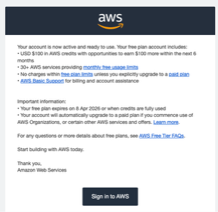

## 2. Account and User Setup

Створено юзера в Identity Center

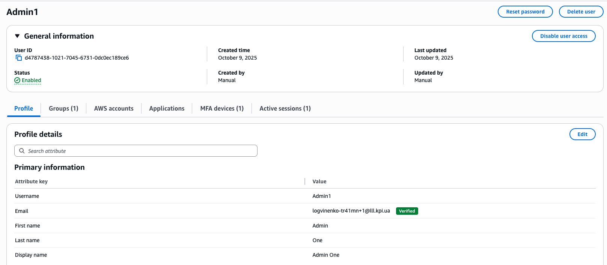

Створено групу, додано туди користувача

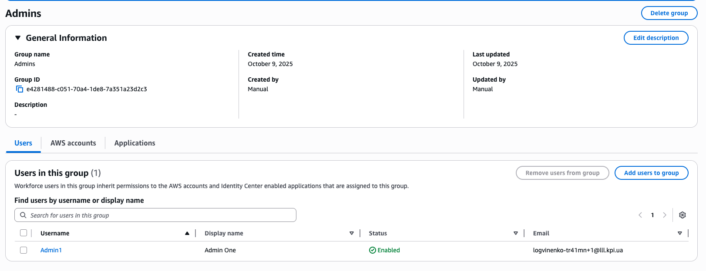

Створено permission set.

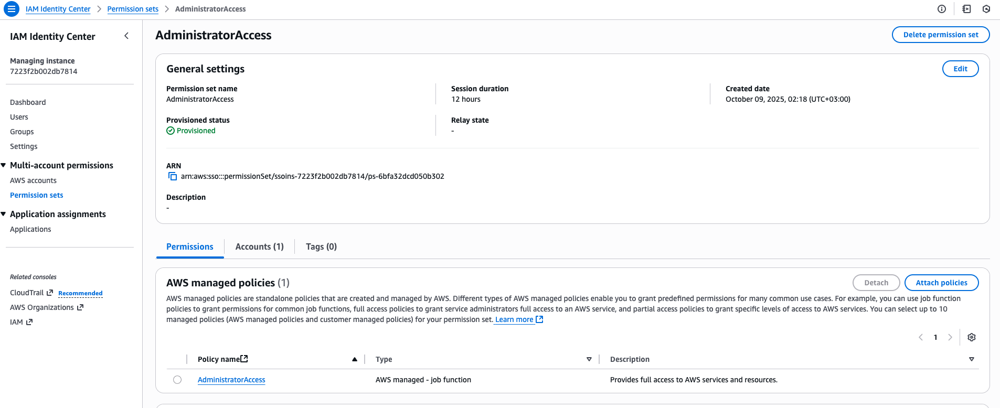

Додано permission set до групи

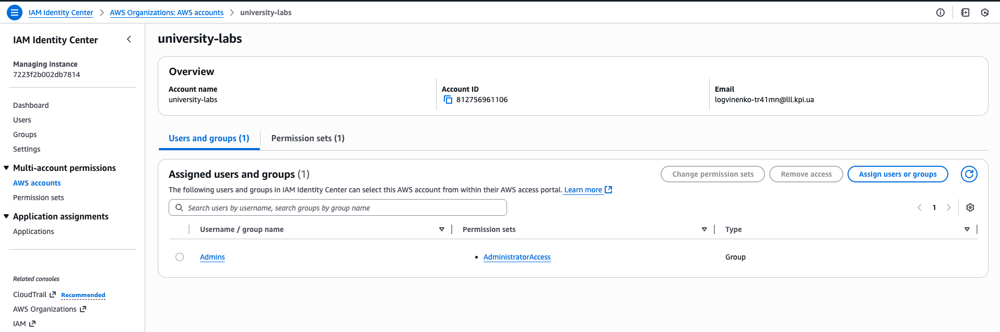

## 3. AWS Organizations Configuration

Створено Organization Unit

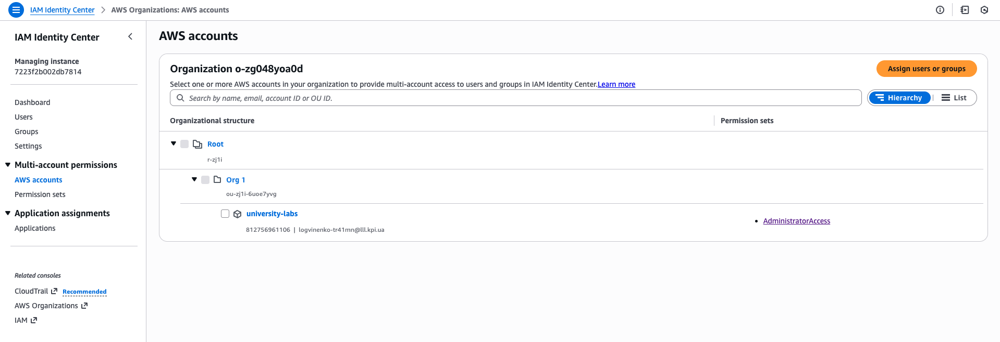

Додано другий акаунт в організацію

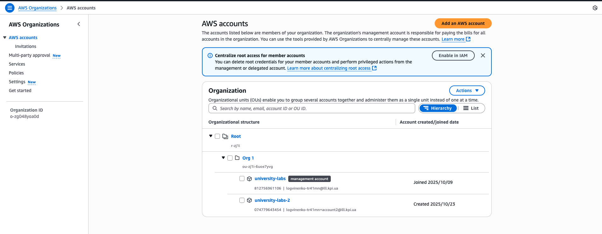

Огляд організації з другого акаунту

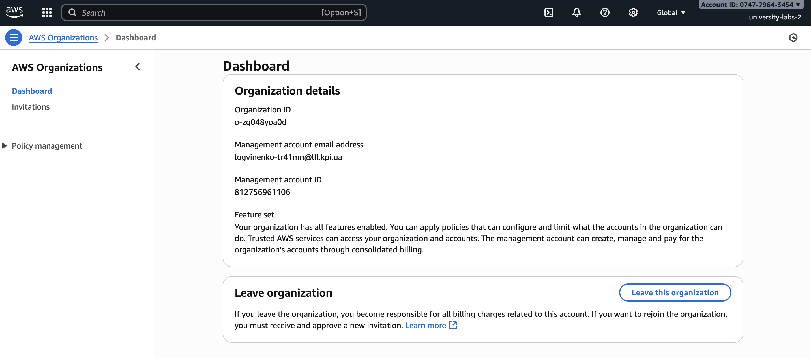

## 4. IAM ReadOnly Role and Policy

Створено IAM user-а.

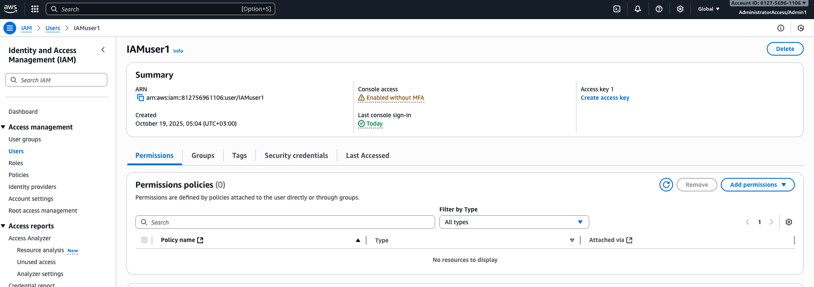

Створено ReadOnly Policy

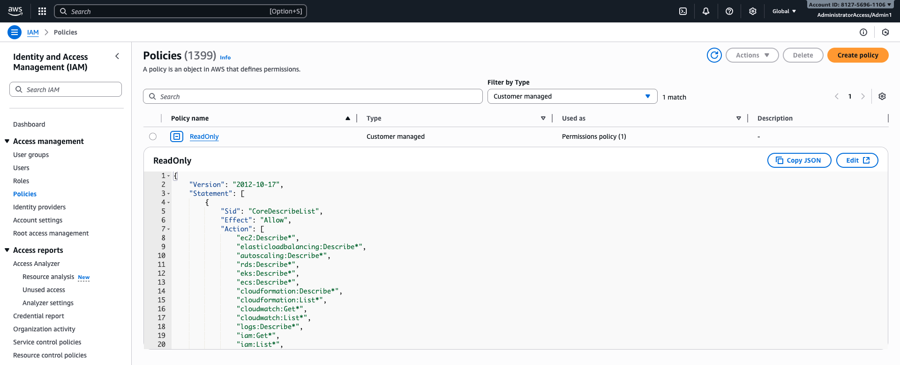
[ReadOnly Policy JSON](files/ReadOnly.json)

Створено роль з ReadOnly policy:

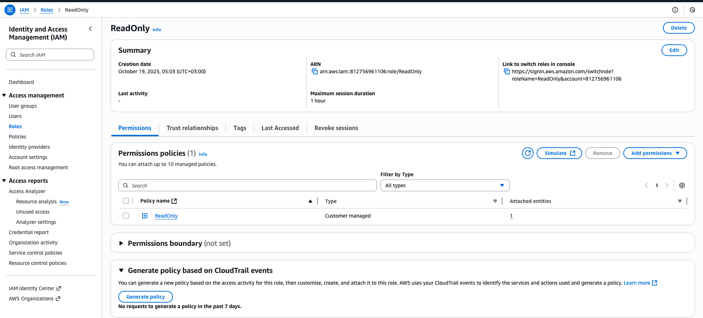

та дозволено її використання зі створеного IAMuser:

[Trust Policy for ReadOnly Role](files/TrustPolicyReadOnlyRole.json)

Вхід через IAM user-a та переключення на роль:

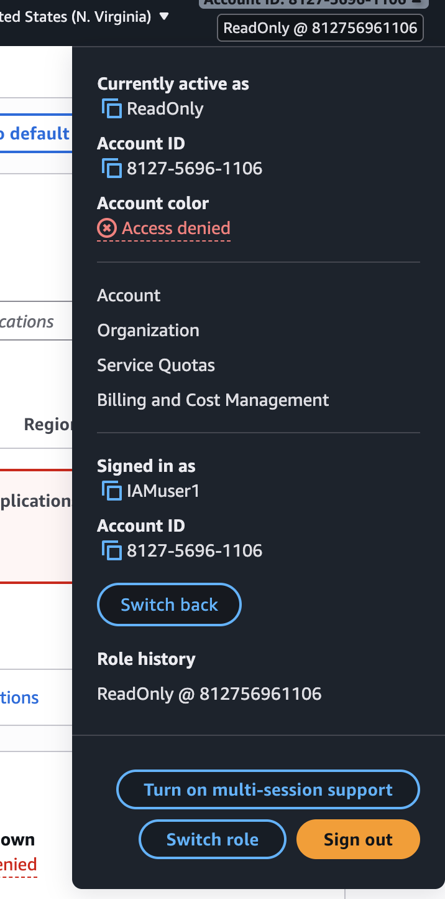

Також CloudFormation Template для ролі і політики (експорт з IaC-generator):

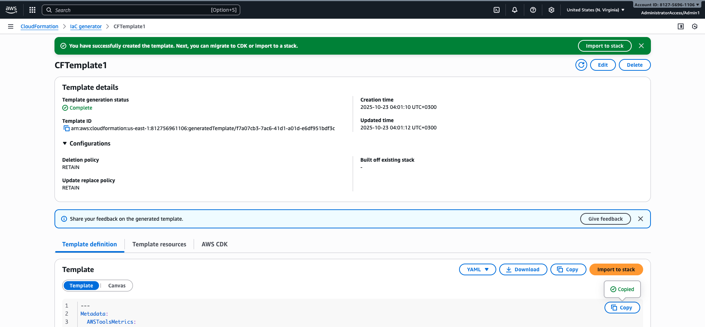
[CloudFormation Template for IAM](files/CFTempl.yaml)

## 6. VPC Infrastructure

VPC ресурси:
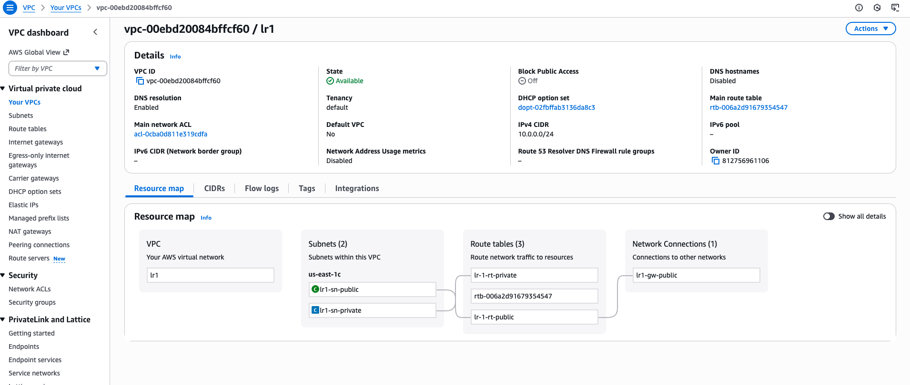

Публічна підмережа:

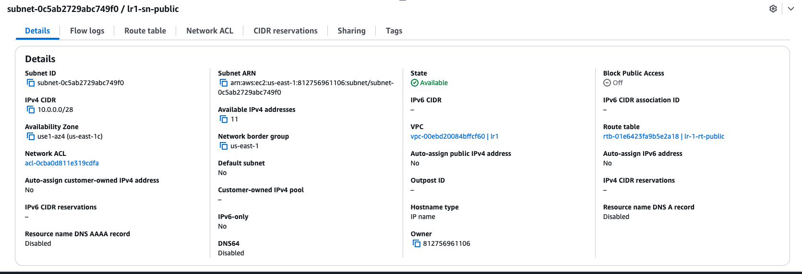

Приватна підмережа:

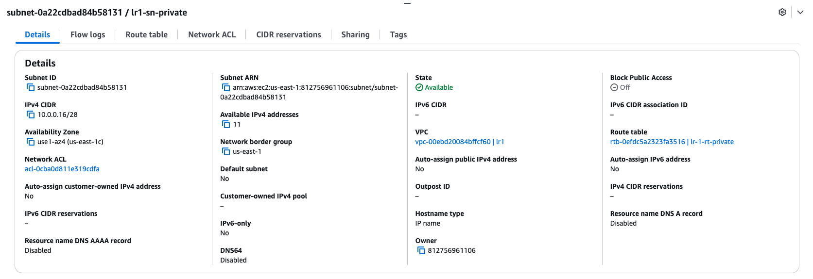

Публічна route talbe:

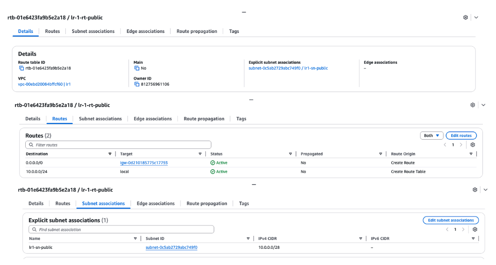

Приватна route talbe:

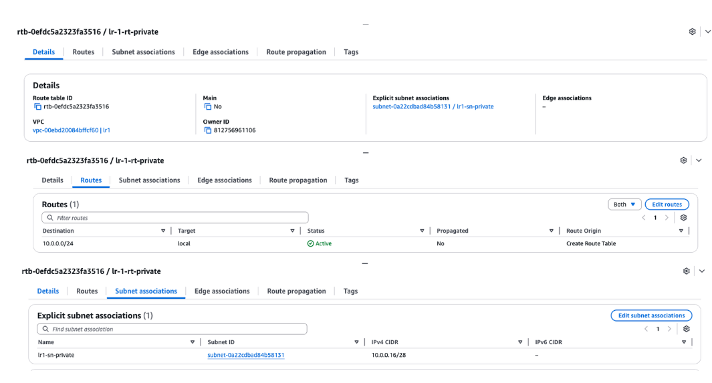

Internet Gateway для публічної таблиці:

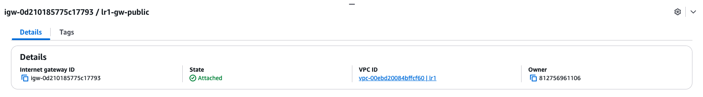

**Configuration File:**

## 7. VPC CloudFormation Stack

Створено CloudFormation Template для ресурсів VPC:
[CloudFormation Template for VPC](files/CFTemplVPC.yaml)

та на його основі створено stack:

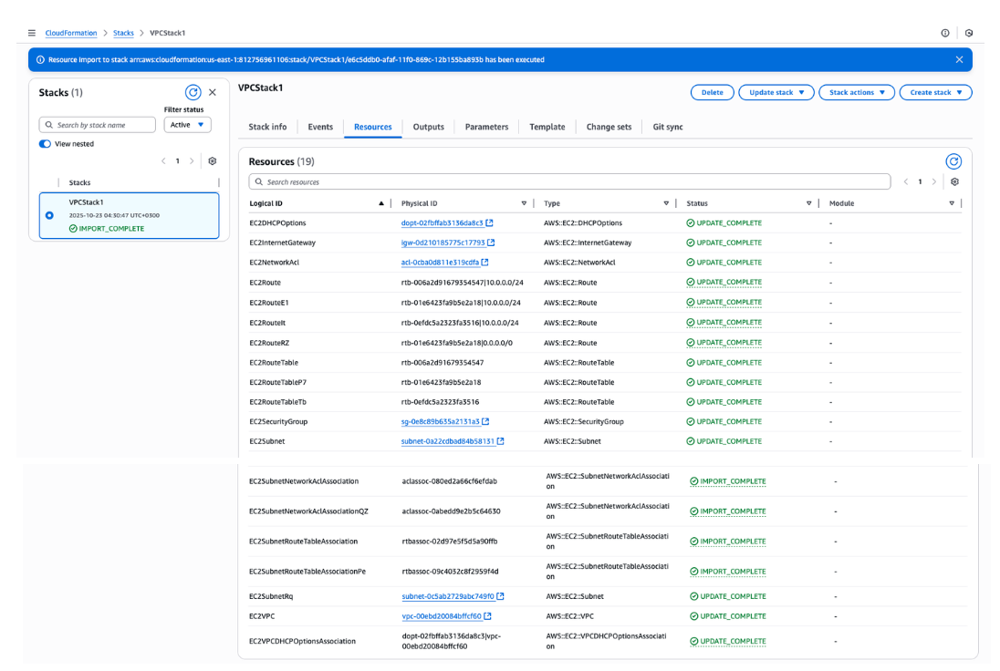

## 8. Cost Calculation

Підрахунок коштів для лаби 2 (EC2 2x)

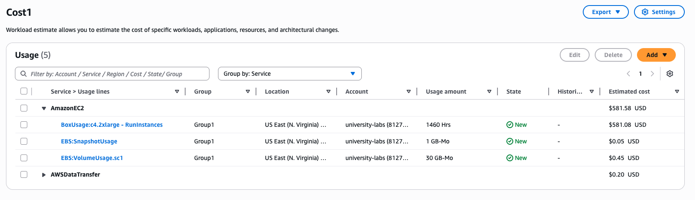
